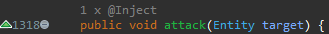

# Mixin Code Minings

  
Display injectors targeting methods and fields. Clicking a mining displays
a list of the injector handlers, selecting a handler opens it.  
By default this feature is toggled off. To toggle it on, click  **Window** > 
**Editor** >  **Toggle Mixin Minings**. A `.class` file must be  open for the 
menu item to be visible. The toggle state persists between sessions.